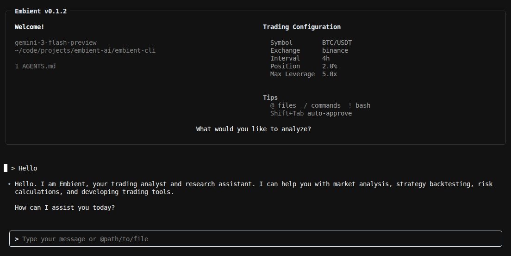
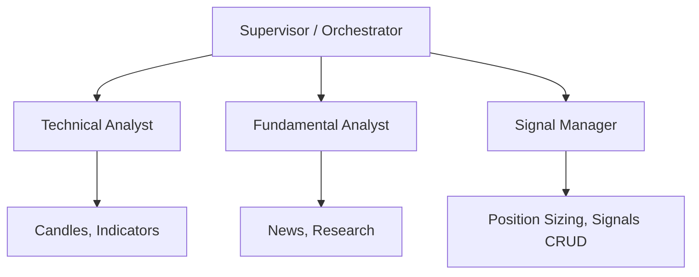

# Embient CLI

<p align="center">
  
</p>

Embient CLI is an AI-powered trading assistant that runs locally while fetching market data from the **Embient**. It combines a multi-agent orchestration system called "Deep Analysts" with trading-specific tools to help you analyze markets and manage trading signals.

**Key Capabilities:**

- **Deep Market Integration**: Built-in tools for candles, technical indicators, and news research.
- **Signal Management**: CRUD operations for trading signals with Human-in-the-Loop (HITL) approval.
- **Multi-Agent Orchestration**: Specialized subagents for technical analysis, fundamentals, and signal management.
- **Secure Authentication**: Browser-based OAuth flow to connect with the Embient Auth.

## 🚀 Quickstart

Embient CLI is optimized for use with `uv`.

**Install dependencies:**

```bash
uv sync
```

**Run the assistant:**

```bash
uv run embient
```

## 🔐 Authentication

To use market data and trading tools, you need to authenticate with the Embient Auth.

```bash
uv run embient login    # Opens browser for OAuth
uv run embient status   # Checks current auth status
uv run embient logout   # Clears local credentials
```

## 🏗️ Deep Analysts Architecture

Embient uses supervisor-subagent architecture with SKILLS to handle complex market analysis tasks.



### Specialized Subagents:

- **Technical Analyst**: Analyzes price action, candles, and technical indicators (RSI, MACD, etc.).
- **Fundamental Analyst**: Researches market news and macro factors.
- **Signal Manager**: Handles signal creation, updates, and risk management (requires user approval).

## 🛠️ Built-in Tools

| Tool                      | Description                                   |
| ------------------------- | --------------------------------------------- |
| `get_latest_candle`       | Current price and 5m candle data              |
| `get_indicator`           | Fetch RSI, MACD, EMAs, and other indicators   |
| `get_candles_around_date` | Retrieve historical candles for back-analysis |
| `create_trading_signal`   | Propose a new trade (requires HITL approval)  |
| `update_trading_signal`   | Adjust existing positions or signals          |
| `calculate_position_size` | Risk-based sizing based on account balance    |

## ⚙️ Configuration

You can configure default trading parameters via environment variables or a config file at `~/.embient/trading.yaml`.

| Variable                        | Description                 | Default    |
| ------------------------------- | --------------------------- | ---------- |
| `EMBIENT_DEFAULT_SYMBOL`        | Default ticker for analysis | `BTC/USDT` |
| `EMBIENT_DEFAULT_EXCHANGE`      | Exchange for market data    | `binance`  |
| `EMBIENT_DEFAULT_INTERVAL`      | Candle timeframe            | `4h`       |
| `EMBIENT_DEFAULT_POSITION_SIZE` | Default risk % per trade    | `2.0`      |

## 🧪 Development

```bash
# Run tests
uv run pytest

# Lint and format
uv run ruff check .
uv run ruff format .
```

---
