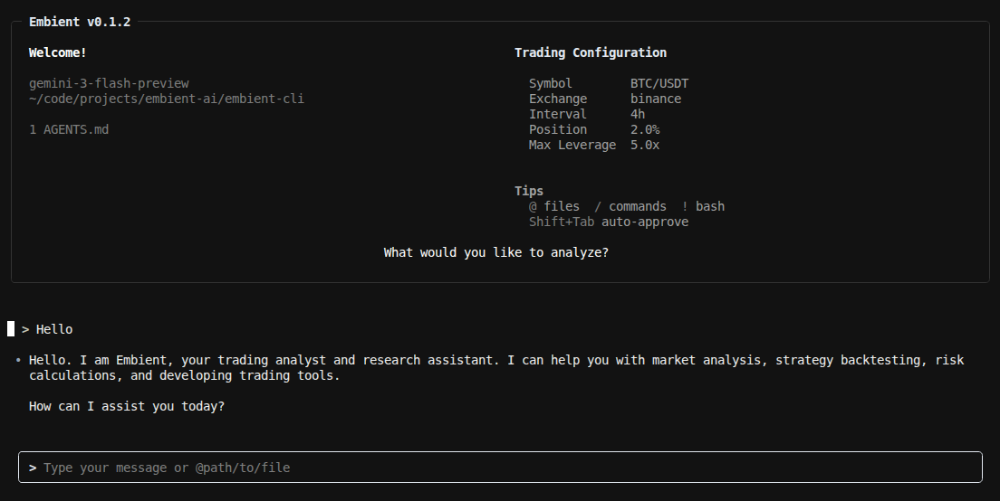

# DeepAlpha CLI

<p align="center">
  
</p>

DeepAlpha CLI is an AI-powered trading assistant that runs in your terminal. It combines a multi-agent orchestration system (Deep Analysts) with trading tools, autonomous background agents (Spawns), and BYOK model support to help you analyze markets and manage positions.

**Key Capabilities:**

- **Multi-Agent Orchestration**: Supervisor delegates to specialized subagents for technical analysis and fundamental research.
- **Deep Market Integration**: Candles, technical indicators, charts, news, fundamentals, and economics calendar.
- **Signal Management**: Create, update, close, and cancel trading signals with Human-in-the-Loop (HITL) approval.
- **Autonomous Spawns**: Background agents that monitor positions or run scheduled tasks using your own API keys (BYOK).
- **BYOK Model Support**: Bring your own OpenAI, Anthropic, or Google API key. Switch models at runtime with `/model`.
- **Memory & Skills**: Persistent agent memory and reusable skill workflows.

## Quickstart

```bash
uv sync                 # Install dependencies
uv run deepalpha login    # Authenticate via browser OAuth
uv run deepalpha          # Launch interactive TUI
```

### CLI Options

```bash
uv run deepalpha -m "Analyze BTC/USDT"     # Auto-submit a prompt
uv run deepalpha -r                         # Resume most recent thread
uv run deepalpha -r <thread_id>             # Resume specific thread
uv run deepalpha --model claude-sonnet-4-5-20250929  # Override model
uv run deepalpha --auto-approve             # Skip HITL confirmations
uv run deepalpha --pipe -m "..."            # Non-interactive, stream to stdout
uv run deepalpha --sandbox modal            # Remote sandbox execution
```

### Management Commands

```bash
uv run deepalpha status                     # Auth status
uv run deepalpha logout                     # Clear credentials
uv run deepalpha list                       # List agents
uv run deepalpha threads list               # List conversation threads
uv run deepalpha threads delete <id>        # Delete a thread
uv run deepalpha spawns list                # List local spawns
uv run deepalpha skills                     # List installed skills
```

### Interactive Commands

`/help`, `/clear`, `/remember`, `/tokens`, `/threads`, `/model`, `/spawns`, `/quit`

## Architecture

### Deep Analysts

Supervisor-subagent architecture with middleware stack for memory, skills, summarization, and HITL approval.

```
Supervisor (Orchestrator)
├── Technical Analyst — multi-timeframe chart analysis (1d, 1h, 15m)
└── Fundamental Analyst — news, financials, economics calendar

Signal management, position closing, spawn creation — handled by supervisor directly (with HITL).
```

### Local Spawns (BYOK)

Autonomous background agents that run locally using your own API keys. Created via the agent ("monitor this position") or programmatically.

- **Monitoring** spawns watch positions: SL/TP breach detection, thesis validation, trailing stops.
- **Task** spawns run scheduled work: pattern scanning, daily summaries, research.
- Schedule types: `once`, `interval` (minutes), `cron` (5-field expression).
- Max 3 concurrent, 5-minute timeout, exponential backoff on errors.

The CLI must be running for spawns to execute. When closed, spawns pause until next launch.

## Tools

### Market Data
| Tool | Description |
|------|-------------|
| `get_latest_candle` | Current price and 5m candle data |
| `get_indicators` | RSI, MACD, EMA, SMA, Bollinger Bands, and more |
| `get_candles_around_date` | Historical candles for back-analysis |
| `analyze_chart` | Rendered chart image via Vermeer |

### Research
| Tool | Description |
|------|-------------|
| `web_search` | General web search (Brave) |
| `get_financial_news` | Trusted financial news sources |
| `get_fundamentals` | Stock fundamentals (TwelveData) |
| `get_economics_calendar` | Economic events (Fed, CPI, employment) |
| `get_user_watchlist` | User's favorite tickers |

### Signals & Positions
| Tool | Description |
|------|-------------|
| `get_user_trading_insights` | List trading signals |
| `create_trading_insight` | Create signal (HITL) |
| `update_trading_insight` | Update signal (HITL) |
| `close_position` | Close executed position (HITL) |
| `cancel_signal` | Cancel unexecuted signal (HITL) |
| `calculate_position_size` | Risk-based position sizing |
| `get_portfolio_summary` | Account balance and P&L |

### Spawns & Memory
| Tool | Description |
|------|-------------|
| `create_spawn` | Create autonomous background agent (HITL) |
| `list_spawns` / `update_spawn` / `cancel_spawn` | Manage spawns |
| `send_notification` | Push/email notification |
| `list_memories` / `create_memory` / `update_memory` / `delete_memory` | Persistent memory |

## Configuration

### LLM Keys (at least one required)

```bash
export OPENAI_API_KEY=sk-...
export ANTHROPIC_API_KEY=sk-ant-...
export GOOGLE_API_KEY=AIza...
```

Keys can also be set in a project `.env` file or in `~/.deepalpha/.env` (user-global). When switching models via `/model`, you'll be prompted to paste the key if missing.

### Trading Defaults

| Variable | Description | Default |
|----------|-------------|---------|
| `DEEPALPHA_DEFAULT_SYMBOL` | Default ticker | `BTC/USDT` |
| `DEEPALPHA_DEFAULT_EXCHANGE` | Exchange | `binance` |
| `DEEPALPHA_DEFAULT_INTERVAL` | Candle timeframe | `4h` |

### Tracing (optional)

```bash
export DEEPALPHA_LANGSMITH_PROJECT=deepalpha-cli
export LANGCHAIN_API_KEY=...
```

## Development

```bash
make test       # Run unit tests (--disable-socket)
make lint       # Ruff check + format diff
make format     # Auto-fix formatting
make coverage   # Coverage report
```

Or manually:

```bash
uv sync --group test
uv run pytest tests/unit_tests/ -vvv
uv run ruff check . && uv run ruff format .
```

---
